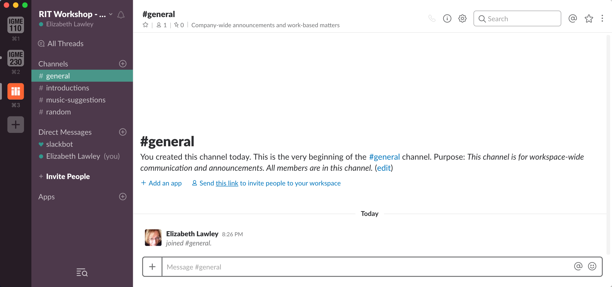
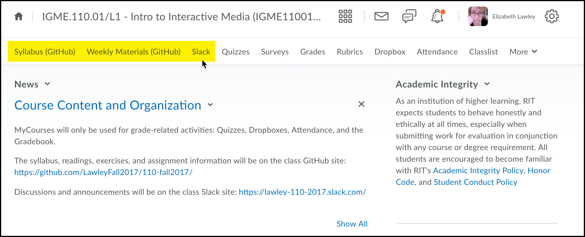

| [Main Page](README.md) | [Next: Using GitHub for Course Materials](2-usingGithub.md) |
|--------------------------------|-----------------------------------------------------|
# 1. Introduction: Understanding GitHub and Slack

Let's start with the basics of what GitHub and Slack are, and what they're used for.

## GitHub
[GitHub](https://github.com/) is a site where anyone can store a repository (often referred to as a "repo") of documents. While it is most often used to store, share, and collaborate on source code for software projects, repos can include any type of digital file--including human-readable documentation pages like this one!

### GitHub vs git
GitHub gets its name from the software it uses to keep track of files and changes, which is called git. Git is what's known as version control (or source control) software, and developers use it to keep track of changes that they and others make to files. 

You can run git on nearly any type of computer--Windows, Mac, Linux, etc--and it's a standard tool for most software developers these days. Git is considered *distributed* version control, which means that each person working with the repository of documents has their own complete copy of the files, which they can sync with any other copy of the repository. Typically, one copy of the repository is placed on a server accessible to all developers, and designated as the primary shared version. Developers modifying the code on their own machines then send their revisions to the copy on the server. 

GitHub is simply a publicly accessible shared server running git, with a web-based interface, which can be used to host both public and private repositories of digital files. Many open source projects are housed on GitHub, allowing anyone to download the most recent version of the software, as well as permitting them to assist with improving the code (don't worry, there are controls over that process!). GitHub isn't the only server offering this functionality, but it's well known and widely used, so it's the one we'll be working with today. 

### Learning git
In today's workshop, we're only going to work with the web-based interface to GitHub, so you won't need to have git installed on your own computer. However, if you end up deciding to regularly publish content on GitHub, it will be important to learn how the underlying git software works, and how to use it on your own computer. My favorite tutorial for this is a James Williamson's [GitHub for Web Designers](https://www.lynda.com/GitHub-tutorials/GitHub-Web-Designers/162276-2.html) tutorial on Lynda.com--unfortunately, it requires a subscription, and could use a litle updating since it was published three years ago. There are also many other tutorials and guides for both git and GitHub available online. 

### Creating a GitHub Account
Before we go any further, make sure you've created a free GitHub account (if you don't already have one). You can do that by clicking the "Sign Up" link in the top right corner of this page! (If you already have an account, there's no need to create a new one--just sign in with that.) 

## Slack

Slack is currently one of the most widely-used group messaging and collaboration tools in technology-focused buseinsses. A Slack workspace provides groups with both public and private channels for discussion, private messaging capability, and file storage/sharing. Authorized users can access the workspace via either a web interface or a dedicated desktop or mobile client application.  

There's a lot more to Slack than than text messaging, though, which is one of the reasons it has become so popular in business settings. (That's also why, even in the ["What is Slack?"](https://get.slack.help/hc/en-us/articles/115004071768-What-is-Slack-) portion of their Getting Started guide, the description of the software is pretty vague!) One of Slack's most powerful features is that it can be extended with a wide variety of apps that integrate it with other online services--from Google Docs and Dropbox to Trello and even GitHub. I'll talk a bit today about how I use some of those Slack integrations in the classroom.

### Joining the Workshop Slack
The best way to understand how Slack works is to use it, so I've created a workspace just for this workshop. I've set it up so that anyone with an @rit.edu address can join it. https://ritworkshop-oct17.slack.com/messages  

>**Note**: If you already use Slack with another group or project, be aware that every Slack workspace is a completely separate instantiation--a login on one Slack workspace can't be used on any other workspace. This can also be confusing for students who are already using Slack for other purposes. You can be logged into different workspaces in different tabs on the same browser, though, and all of the Slack clients allow you to be logged into multiple workspaces. 

Slack workspaces can also be set up with a generic invitation link for joining; those invitations expire after a set date. And/or you can generate individual invitations to specific email addresses. 

Here's what my Mac desktop client looks like when I'm logged into the workspaces for both of my current classes and the one for this workshop:

I've done only a small amount of customization on this workspace. Click on the  **Channels** heading (the word itself, not the plus sign), to see a list of available channels in the workspace. In addition to the two channels (\#general and \#random) that are created by default in a new workspace, there should be three additional channels visible to you: \#introductions, \#github, and \#music-suggestions. Go ahead and join the \#introductions channel, and post a brief intro there. 

I'll talk more about how I use Slack, and how to customize it, in the [Using Slack](3-usingSlack.md) section of the workshop. In the meantime, however, feel free to use the \#general channel to chat about the session as we go along. (Full disclosure: I won't stay logged into this workspace after the workshop is over, so while you can continue to chat with other participants, you won't be able to ask me questions there. Feel free to email me, though!)

## MyCourses Integration and Student Privacy
Our students already have far too many different tools and sites that they need to keep track of, and I wanted to be sure that I wasn't making things harder for them by moving my content to a new space. I also needed to make sure that I wasn't violating student privacy by making personally identifiable information public.

MyCourses allows faculty to modify the navigation bar for a course, so I used that functionality to remove the existing links to the "Content" and "Discussion" sections, and replace them with direct links to the syllabus and the schedule of topics/readings on GitHub, as well as to the Slack workspace. Same starting point, same number of clicks for students, but different destination for the links.

I still keep all personally identifiable information--classlists, grades, etc--in myCourses. I also limit access to the class Slack to people with @rit.edu addresses for the first week to make it easy for students to sign up, and then change it to invitation-only after add/drop has ended. 

| [Main Page](README.md) | [Next: Using GitHub for Course Materials](2-usingGithub.md) |
|--------------------------------|-----------------------------------------------------|

***This page is part of Liz Lawley's "RIT Teachers on Teaching" workshop, 11 October 2017***

