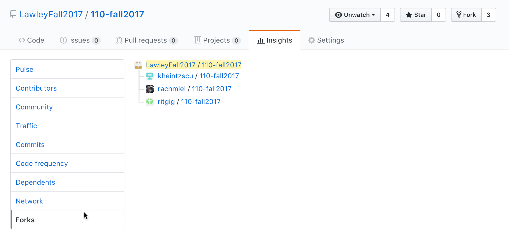

| [Previous: Using Slack](3-usingSlack.md) | [Main Page](README.md) | [Next: Creating a Slack Workspace](5-creatingSlack.md) |
|--------------------------------|-----------------------------|------------------------|

# Creating Content on GitHub

There are two basic ways to create content on GitHub. One is to make a copy of ("fork") an existing repository of content and modify that; the other is to create an entirely new repository with your own original content. 

I'll talk about each approach briefly in the session, but for more detailed information I suggest looking at GitHub's own "Bootcamp" articles describing the basics of each of these processes: 

- [Create a Repo](https://help.github.com/articles/create-a-repo/)
- [Fork a Repo](https://help.github.com/articles/fork-a-repo/)

# Public vs Private Repositories
Free GitHub accounts can only be used to create public rather than private repositories, which can be a problem if you're not ready to share your materials with the entire internet. However, GitHub offers [educational discounts](https://education.github.com) for both teachers and students that allow you to create unlimited private repositories. (You don't need that today, but you might if you plan to start creating your own content in GitHub.)

## Creating vs Forking Content
If there's already a repository of content that's similar to what you're trying to create, the easiest approach is to fork that repo and then modify your copy. If not, you'll need to create a new repository to house your content. 

Let's use my [freshman survey class](https://github.com/LawleyFall2017/110-fall2017) as an example. I created that repository from scratch because I wasn't able to find any examples of course materials on line that were similar enough to make it worth using them as a starting point. 

However, I have several colleagues teaching sections of the same course, and some of them wanted to build on what I'd already created. They used GitHub to "fork" my repository, which placed a copy of the files in their personal GitHub account. When you fork a repo, GitHub doesn't just copy the files--it also keeps track of the connection between the original repository and your copy. On the original repo, you can see all copies that have been forked from it; on the forked copy, you can see a link back to the original. 

If you look at the top of any page in [the class repo](https://github.com/LawleyFall2017/110-fall2017), you'll see an indicator telling you how many times the repository has been forked. There are two other people teaching sections of the same class this semester, and each of them has forked a copy of my repo. If you click on that number 2, you'll get more information about the network of connected repositories. 

There's a lot of information to unpack here, but for now we'll just look at the "Forks" section, which shows you the users who forked this repo (ritgig and rachmiel are both teaching sections of the class this semester; kheintzscu attended a workshop I gave at the DML conference earlier this month), and provides links to their forked copies. 

All of those users are now able to modify their copies for use in their own classes. If they make a change that they think I'd like to incorporate into my original--like correcting a typo, or adding a link to a new reading--they can do that by creating something called a "pull request." 

Why "pull" and not "push"? Because they don't have permission to push content into my repository. Instead, they save the changes to a "branch" of their own repository (a temporary copy in which you can store changes that you're not yet sure you want to incorporate into your own code), and then generate a request that asks me to pull that change into my own copy. I can choose to accept that request and incorporate their changes, or to reject it. 

In my advanced classes, I also encourage my students to fork their own copy of the class materials and submit pull requests when they find errors in them. This serves multiple purposes: (1)it's helpful to me, (2) it gives them a sense of agency in making the materials better, and (3) it models behavior that will be important in real-world development contexts, both at work and in contributions to open source software. 

Want to try forking a repository yourself? If you're logged into your GitHub account, you can click on the word "Fork" at the top of this page and it will make a copy of these workshop materials in your own GitHub account. You can then edit those materials in whatever way you'd like--you can even submit pull requests to ask me to incorporate your changes into my repository. 

Note: Keeping your personal copy of a repository in sync with the changes made to the original is a little more complicated, and beyond the scope of this workshop. Advanced users can read a bit about it in this [Stack Overflow Q&A](https://stackoverflow.com/questions/7244321/how-do-i-update-a-github-forked-repository). 

## GitHub "Organizations"

You may have noticed that these course materials aren't in my [personal GitHub account](https://github.com/mamamusings)--they're in a GitHub organization called [LawleyWorkshops](https://github.com/LawleyWorkshops). And my fall 2017 class repositories are all in an organization called [LawleyFall2017](https://github.com/LawleyFall2017). 

Since GitHub doesn't allow you to create any kind of organizational structure (like folders/directories) to group repositories in your account, organizations are currently the only way to group related content together. We won't have time to talk about organizations today, but if you start using GitHub on a regular basis, you may want to consider using organizations to group repositories for specific classes or semesters. If you do this, and want to include private repositories, you will also need to apply for an educational discount for each organization.

| [Previous: Using Slack](3-usingSlack.md) | [Main Page](README.md) | [Next: Creating a Slack Workspace](5-creatingSlack.md) |
|--------------------------------|-----------------------------|------------------------|

***This page is part of Liz Lawley's "RIT Teachers on Teaching" workshop, 11 October 2017***

