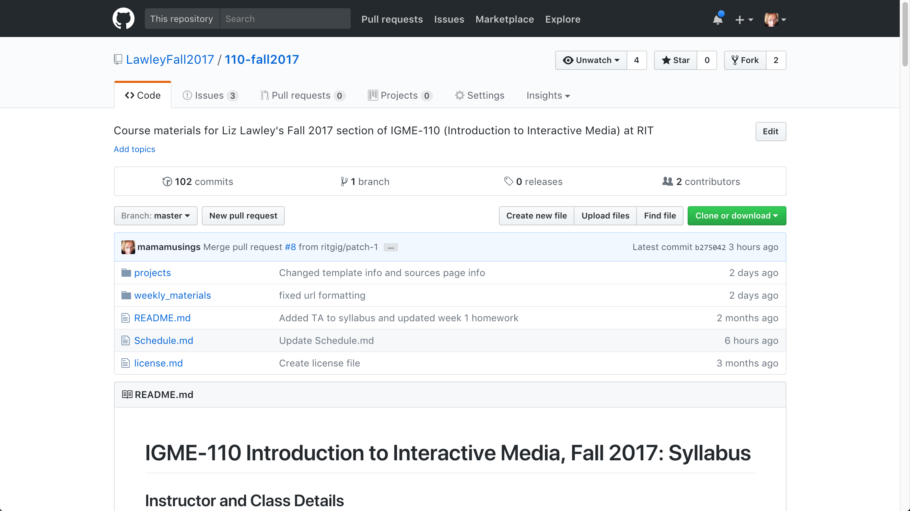

| [Previous Page: 1. Introduction](introduction.md) | [Back to Main Page](README.md) | [Next Page: 3. Using Slack](usingSlack.md) |
|--------------------------------|-----------------------------|------------------------|

# 2. Using GitHub for Course Materials

If you're reading this, you're already using GitHub. Congratulations! Notice that you haven't had to install any software, 

This is as much "using GitHub" as your students will need to do. If it's a public repository, they don't even need a GitHub account to access the materials. I use a repo for the course materials in my [freshman survey class on Interactive Media], and we never talk at all about git or how to create or modify files in a repository--it's simply a server that I use to publish materials for my students. 

## Why GitHub?
So, if all I'm doing is publishing read-only materials for students, why use GitHub rather than our university's learning management system? Because the LMS locks the content up so that only students currently registered for the class can access it, and my goal is to make my materials easily accessible to anyone who's interested in them. 

I often receive requests from students and colleagues at RIT who would like to see my course materials--especially students considering taking the class in the future and want to know what topics I cover, and faculty who are teaching the same class and want to use or modify my materials for their own section. It's a cumbersome process to add each interested person individually to a specific section of the course in the LMS, and make sure their permissions are set properly.

I also frequently receive requests from people *outside* of RIT who are interested in my course materials, and there's no way at all for me to share materials from the LMS with them. These fall into several categories:
- Faculty members at other schools who are interested in reviewing my materials and possibly adapting them for their own use, something that I encourage (most of my materials are CC-licensed). 
- Alumni who no longer have accounts on the LMS, but want access to up-to-date versions of my materials and links.
- Friends and colleagues who'd like to do one or more of the exercises or tutorials that I've posted for their own professional development. 

It's possible to address most of those needs by simply putting my materials up on my university or personal website--which is what I did for years. Back in 2004, I actually modified Movable Type (the most popular blogging platform before WordPress took over) as a courseware system, and then [published instructions](http://mamamusings.net/archives/2004/01/06/mt_courseware_stepbystep.php) on how other faculty could do the same thing. If all I wanted to do was *publish* the materials, a simple website or blog would still work fine for that. 

However, I don't just want to *publish* my materials. I also want to invite others to copy them, modify them, and extend them--and then to share their additions and corrections back with me when they do. In other words, I want to treat my course materials very much like open source software! 

## Exploring My GitHub Course Repo

Let's take a look at the GitHub repo for the first-year survey class that I'm teaching this semester--[Introduction to Interactive Media](https://github.com/LawleyFall2017/110-fall2017). 



The site has three files, and two directories. The README.md file is the default file displayed in a repo, so that's where I put the syllabus. The other two files are the schedule of topics and readings (Schedule.md) and the license for the repo (in this case, a Creative Commons 4.0 license that allows reuse and modification, but requires that I be given attribution, and that the resulting work not be used commercially.) All of my in-class and homework exercises are stored in the weekly_materials folder, organized by week, and project assignments are in the projects folder. Everything in the subfolders is linked to from either the syllabus or the schedule. 

What's *not* in the repo is anything with personally identifiable information about my students--classlists, grades, and discussions. All grade-related information, including online quizzes and dropboxes for assignments, is still in our LMS, and discussions have all moved to Slack. 

## What's an .md File?
The .md extension on the files (including the one you're reading right now) refers to [Markdown](https://en.wikipedia.org/wiki/Markdown), a simple way of adding formatting to text files that doesn't require you to understand all the complexities of HTML in order to be able to format a page for display on the web. 

For example, here's the Markdown source for the heading and paragraph above:

```Markdown
## What's an .md File?
The .md extension on the files (including the one you're reading right now) refers to [Markdown](https://en.wikipedia.org/wiki/Markdown), a simple way of adding formatting to text files that doesn't require you to understand all the complexities of HTML in order to be able to format a page for display on the web.
```

GitHub has an excellent guide called ["Mastering Markdown"](https://guides.github.com/features/mastering-markdown/) that explains how Markdown works. 

## Linking GitHub from the LMS
One last note--my students already have far too many different tools and sites that they need to keep track of, and I wanted to be sure that I wasn't making things harder for them by moving my content to a new space.

Our LMS allows us to modify the navigation bar for a course, so I used that functionality to remove the existing links to the "Content" and "Discussion" sections of the LMS and replace them with direct links to the syllabus and the schedule of topics/readings on GitHub, as well as to the Slack workspace). Same starting point, same number of clicks for students, but different destination for the links.


| [Previous: Introduction](introduction.md) | [Main Page](README.md) | [Next: Using Slack](usingSlack.md) |
|--------------------------------|-----------------------------|------------------------|

***This page is part of Liz Lawley's "RIT Teachers on Teaching" workshop, 11 October 2017***
