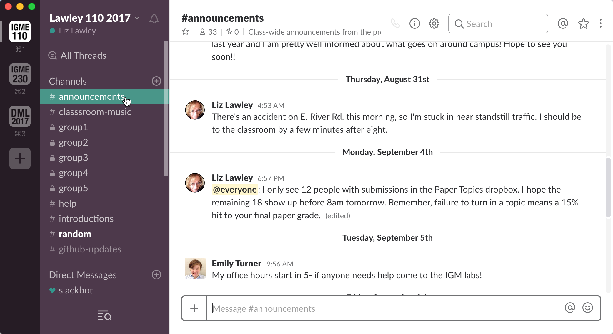
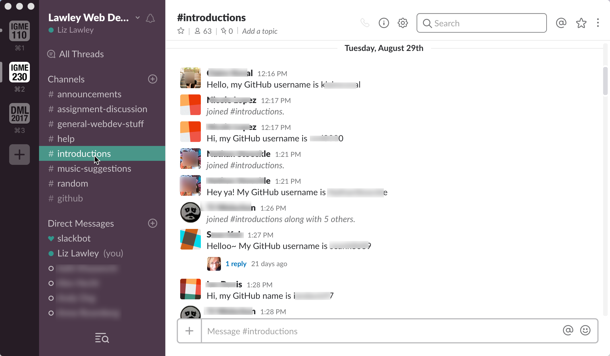
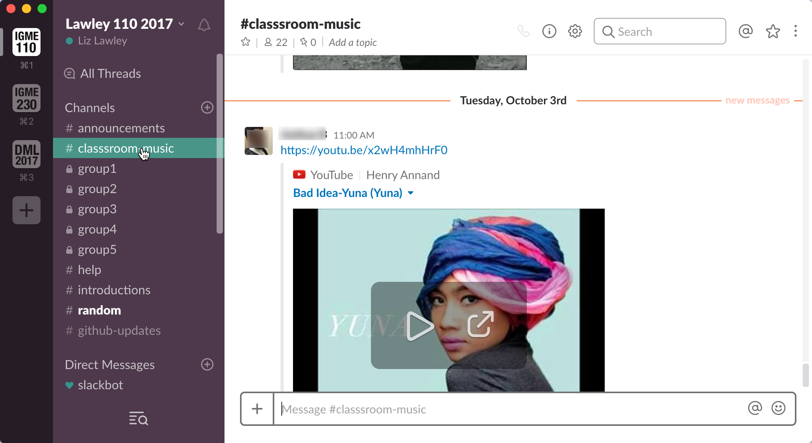
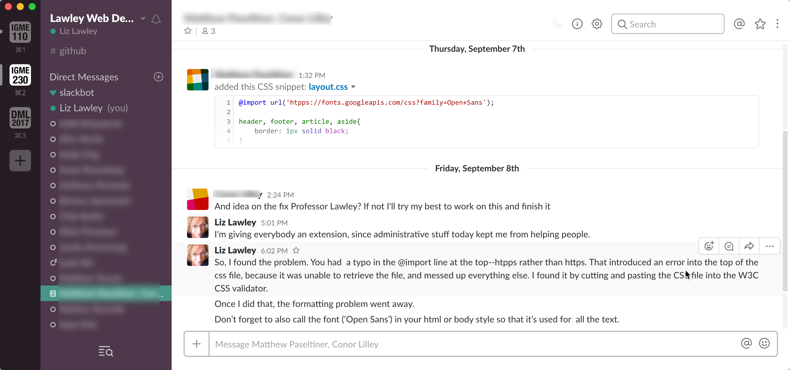

| [Previous: Using GitHub](usingGithub.md) | [Main Page](README.md) | [Next: Creating GitHub Content](creatingGithub.md) |
|--------------------------------|-----------------------------|------------------------|

# 3. Using Slack for Class Communication

myCourses provides us with group and private chat options, as well as discussion forums. So why add another tool to the mix? And why Slack in particular?

- College students typically don't check their email frequently--and when they do, they see it as a formal medium for communicating with authority figures, rather than a casual medium for asking quick questions. Providing an easy-to-use robust messaging system with a good mobile client makes it more likely that they'll see announcements quickly, and that they'll use it to ask questions and interact with me and classmates.
- When our students graduate or go out on co-op, many of them will end up at companies using Slack for workgroup communication. This gives them hands-on experience with an important productivity tool.
- Slack's integrations, especially with Google Docs, GitHub, and Trello, are extremely useful in my classes, where those services are also an important part of the instructional technology used. 
- Slack makes it easy for students to upload the files they want me to look at, and it properly displays/formats code files.
- I can easily create private group chat channels for student groups, and be a member of those channels, which helps greatly in assessing ongoing participation and group dynamics issues.
- It's easy for me to add external people to a Slack workspace, which comes in handy when I've got a class working on a project with outside experts. 

## Using Slack to Prioritize Student Interactions
One of the biggest drawbacks of using any type of real-time messaging with active groups, of course, is that it can turn into a major source of productivity-killing interruptions. That's why for years I've avoided using Slack for most work-related activities--despite my involvement with social computing research, and my tendency to be an aggressively early adopter of those technologies. 

However, by restricting my use of Slack to *only* my current classes, I'm actually able to improve my task focus rather than diluting it. Unlike my email, which is full of requests from a wide variety of sources, Slack only has questions from my students. When I visit the class workspace, I know I won't be distracted by other tasks, and I can focus on interacting with my students. To ensure that this remains the case as the number of class workspaces increases, I also log out of class workspaces once a term is over--I'll still respond to former students' questions, of course, but they need to ask them in person or by email. 

## Encouraging Student Use of Slack
Getting students (or any group!) to adopt new communication tools can be a challenge, and the first time I tried using Slack in the classroom it wasn't as successful as I'd hoped. Since then, I've started doing a number of things to increase its use my students. 

For privacy reasons, I can't give you a live tour of my class workspaces, but I've created anonymized screenshots to illustrate some of my approaches.

### Preventing Notification Spam
One of the biggest problems with having students (or anyone else) adopt a new chat tool is the risk that they'll have to deal with too much unwanted/unnecessary chatter. But if students don't install the mobile client and turn on notifications, they'll lose much of the value of the tool. 

To address that problem, I renamed the \#general channel (which all new users are automatically subscribed to by default) to \#announcements, and set it so that only my TAs and I can post to it. (That channel, unfortunately, is the only one that Slack allows you to restrict posting in.) I use the \#announcements channel to let them know about useful things, like upcoming deadlines, extensions on due dates, and why I might be a few minutes late for class; that gives them a good reason to set up the mobile client and enable notifications. Because nobody but the TAs and I can post there, they don't mind keeping notifications turned on for that channel. 

### Introductory Exercise
The first week of class I assign an exercise that requires students to create an account on the class Slack, and post an introduction. In my web design class where I'll need to add their GitHub usernames to a class group, I use the introduction to have them give me their username.

I also strongly encourage them to install the mobile client on their phones--and to make that idea more palatable I walk them through the various options Slack provides for limiting notifications. You can mute entire channels, set do not disturb times, or tell Slack only to notify you if you're referenced by name, or a specific keyword is used.  

In my own Slack mobile client, I have notifications turned on only for posts to the \#announcements and \#help channels, and for private messages.

### Inviting Playful Engagement
In each class workspace, I create at least one non-classwork channel that invites playful participation--this semester I created a music suggestions channel where they can post songs they'd like me to add to the class playlist (which I play on in the background when they're working on in-class exercises).

Be aware that anyone in the workspace can create their own public (open to anyone in the workspace) or private (by invitation only) channels. When I first showed my freshmen the music channel, and explained that they could also make channels of their own, one of them immediately decided to make a \#dankmemes channel! This provided an excellent opportunity for me to talk about appropriate vs inappropriate use of social media in work and school contexts...

### Slack-Only Opportunities
I tell students that they're welcome to continue using email to contact for me for course related issues, and that after the initial introduction exercise is done they can choose not to check Slack again. However, I also do offer some "bonus" opportunities for those who do use Slack--for instance, when I recently offered my web design students the opportunity to resubmit a project for an improved grade, I told them that they needed to contact me via Slack (and include a link) to request that I regrade their revision.

### Integrating Helpful Apps
Take a look at the \#github channel in our workspace. This is an example of a Slack integration. I've set it up so that every time I send changes to the GitHub repo for the workshop, that information is automatically posted to this channel. In my classes, this lets students see if and when I've made changes to the syllabus or assignments--and what the short description of those changes are. 

Other integrations I've used in my classes include Google Docs (which makes it easy for my students to share drafts of documents with me and each other) and Trello (a project management site that students in my advanced classes use to track group project tasks). These integrations give them a "one-stop shop" for other industry-standard web-based tools that we may use in class. 

These integrations tend to be most helpful for group projects. In order to keep tabs on how groups are doing, I create private Slack channels for each group and ask them to use that--rather than texting, FB messenger, or other chat tools. That allows me to respond to questions or problems in the group, and also makes it easy for them to set up specific integrations with their groups' Google Docs, Dropbox folders, and/or Trello projects. 

### Commitment to Quick Responses
Most importantly, I've committed to responding quickly to student messages. I have the Slack client on my phone's home screen, and I check for new notifications at least twice a day. If a message can be answered quickly, I do it then. If not, I acknowledge it, let them know I'll get back to them, and mark it with a star for later access. When I have a little more time, I go through my starred messages and respond in more depth. 

(The example below also shows how easy it is for them to share code with me in their messages.)

## Slack vs Email
I have not stopped using email for communicating with students, of course. Anything that I might need a "paper trail" on--warnings about grades, requests to meet with them in my office hours, etc--still gets sent by email. And there are definitely students who prefer using a familiar mode of communication to contact me. 

Ideally, though, I want my students to see Slack as an easy and non-threatening environment to ask questions, make comments, and get help. I tell them (and it's true) that it allows me to prioritize their messages over the piles of email that I get on a daily basis. And I've found that once I get them over the adoption hump, most of them appreciate Slack's informality and ephemerality. Most importantly, I hear from far more students who have questions or concerns than I did in the past. 

| [Previous: Using GitHub](usingGithub.md) | [Main Page](README.md) | [Next: Creating GitHub Content](creatingGithub.md) |
|--------------------------------|-----------------------------|------------------------|

***This page is part of Liz Lawley's "RIT Teachers on Teaching" workshop, 11 October 2017***